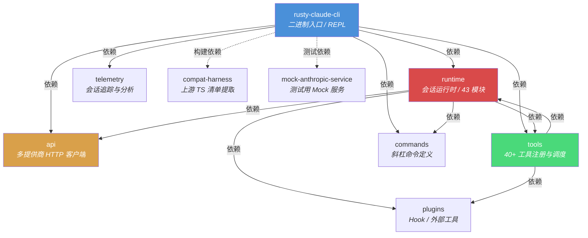
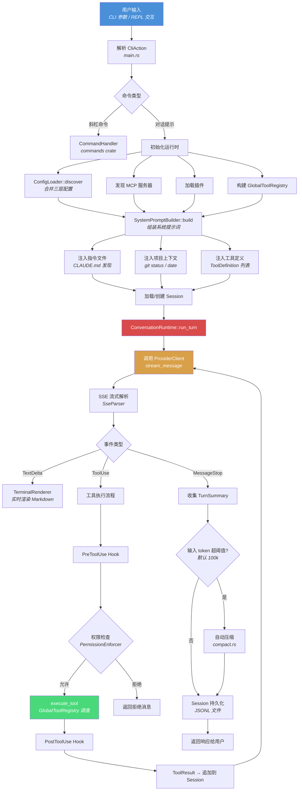
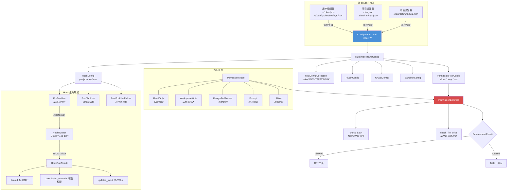
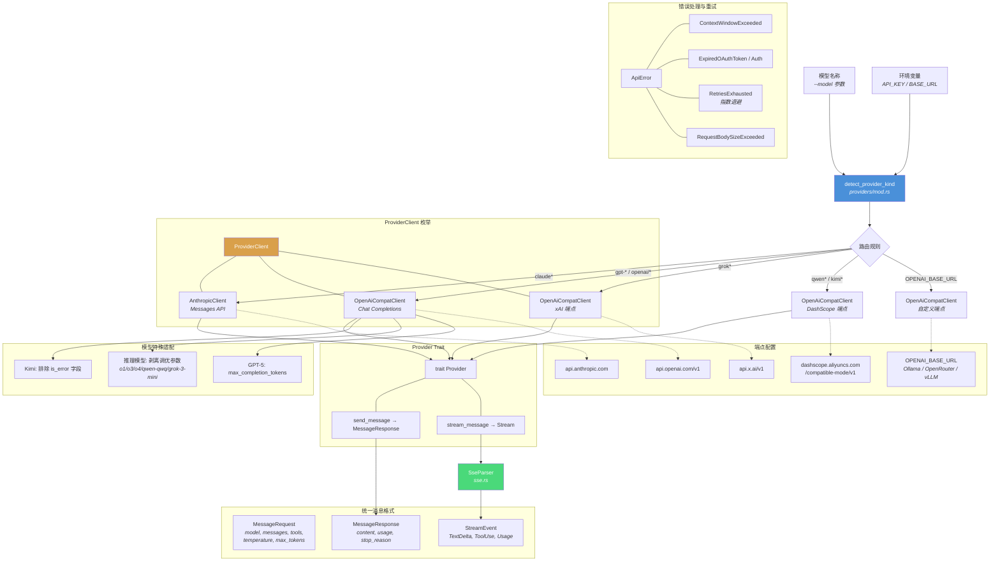
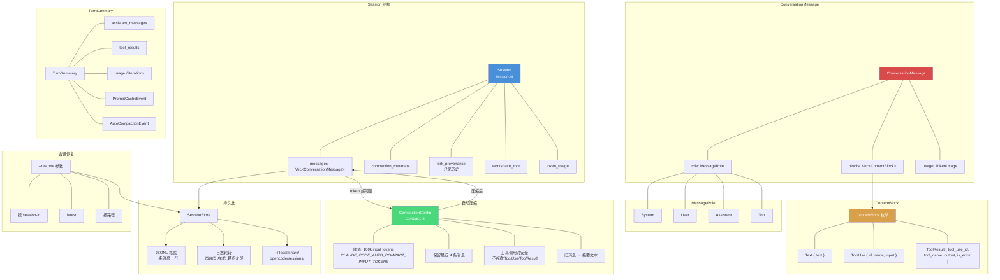
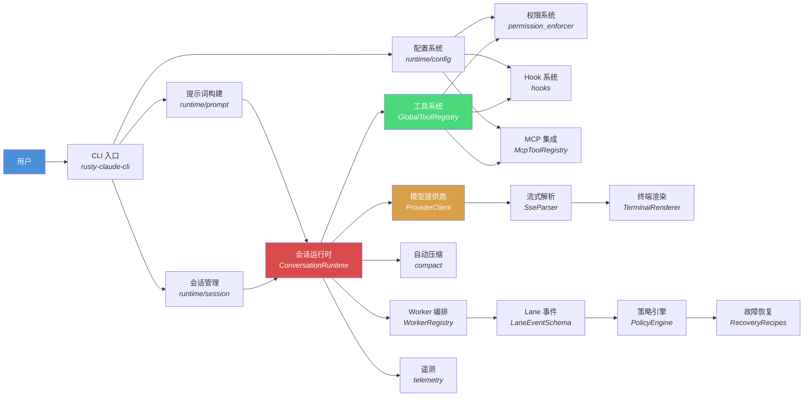

# claw-code 业务逻辑知识图谱

> claw-code 是 Claude Code CLI 的 Rust 开源重写。本文档以 Mermaid 图谱形式展示其完整业务逻辑架构。

---

## 1. Crate 依赖关系图

9 个 Rust crate 构成整个工作区，`rusty-claude-cli` 是二进制入口，依赖其余所有库 crate。



---

## 2. 核心业务流程图

用户输入到最终响应的完整生命周期。这是 claw-code 最核心的业务循环。



---

## 3. 工具系统架构图

40+ 内置工具通过 `GlobalToolRegistry` 统一管理，支持内置、插件、MCP、运行时四类工具来源。

```mermaid
flowchart TD
    REG["GlobalToolRegistry<br/><i>tools/src/lib.rs</i>"]

    subgraph 工具来源
        BUILTIN["内置工具<br/><i>mvp_tool_specs() → 40 个</i>"]
        PLUGIN["插件工具<br/><i>with_plugin_tools()</i>"]
        MCP_T["MCP 工具<br/><i>McpToolRegistry</i>"]
        RUNTIME_T["运行时工具<br/><i>with_runtime_tools()</i>"]
    end

    BUILTIN --> REG
    PLUGIN --> REG
    MCP_T --> REG
    RUNTIME_T --> REG

    REG --> DISPATCH["execute_tool(name, input)"]
    DISPATCH --> ENFORCE["PermissionEnforcer::check"]

    subgraph 文件与搜索工具
        T_READ["read_file<br/><i>文件读取</i>"]
        T_WRITE["write_file<br/><i>文件写入</i>"]
        T_EDIT["edit_file<br/><i>精确替换</i>"]
        T_GLOB["glob_search<br/><i>文件名匹配</i>"]
        T_GREP["grep_search<br/><i>内容搜索</i>"]
    end

    subgraph Shell 工具
        T_BASH["bash<br/><i>命令执行 / 沙箱</i>"]
        T_PS["PowerShell<br/><i>Windows</i>"]
    end

    subgraph 网络工具
        T_FETCH["WebFetch<br/><i>URL 内容获取</i>"]
        T_SEARCH["WebSearch<br/><i>搜索引擎</i>"]
    end

    subgraph 协调工具
        T_AGENT["Agent<br/><i>子代理创建</i>"]
        T_SKILL["Skill<br/><i>技能调用</i>"]
        T_ASK["AskUserQuestion<br/><i>交互确认</i>"]
    end

    subgraph 任务管理工具
        T_TC["TaskCreate"]
        T_TG["TaskGet"]
        T_TL["TaskList"]
        T_TU["TaskUpdate"]
        T_TS["TaskStop"]
        T_TO["TaskOutput"]
    end

    subgraph Worker 工具
        T_WC["WorkerCreate"]
        T_WS["WorkerSendPrompt"]
        T_WO["WorkerObserve"]
        T_WT["WorkerTerminate"]
    end

    subgraph MCP/LSP 工具
        T_LSP["LSP<br/><i>语言服务器协议</i>"]
        T_MCPR["ListMcpResources"]
        T_MCPREAD["ReadMcpResource"]
        T_MCPAUTH["McpAuth"]
    end

    subgraph 调度工具
        T_CRON_C["CronCreate"]
        T_CRON_D["CronDelete"]
        T_CRON_L["CronList"]
        T_REMOTE["RemoteTrigger"]
    end

    subgraph 其他工具
        T_TODO["TodoWrite"]
        T_NB["NotebookEdit"]
        T_PLAN_E["EnterPlanMode"]
        T_PLAN_X["ExitPlanMode"]
        T_CONFIG["Config"]
    end

    ENFORCE -->|"允许"| 文件与搜索工具
    ENFORCE -->|"允许"| Shell 工具
    ENFORCE -->|"允许"| 网络工具
    ENFORCE -->|"允许"| 协调工具
    ENFORCE -->|"允许"| 任务管理工具
    ENFORCE -->|"允许"| Worker 工具
    ENFORCE -->|"允许"| MCP/LSP 工具
    ENFORCE -->|"允许"| 调度工具
    ENFORCE -->|"允许"| 其他工具

    style REG fill:#4AD97A,color:#fff
    style ENFORCE fill:#D94A4A,color:#fff
```

---

## 4. 配置与权限系统图

三层配置文件合并 + 三级权限模型 + Hook 生命周期管理。



---

## 5. 多模型提供商架构图

`ProviderClient` 枚举统一抽象多家大模型 API，支持 Anthropic、OpenAI 兼容、xAI、DashScope。



---

## 6. 会话与消息模型图

Session 管理完整对话历史，支持 JSONL 持久化、日志轮转、自动压缩。



---

## 7. 高级子系统关系图

Worker 编排、Lane 事件、分支健康检测、故障恢复、策略引擎共同构成 claw-code 的自主编排能力。

```mermaid
flowchart TD
    subgraph Worker 编排系统
        WR["WorkerRegistry<br/><i>worker_boot.rs</i>"]
        WS_STATE["WorkerStatus 状态机"]
        WS_SPAWN["Spawning"]
        WS_TRUST["TrustRequired"]
        WS_READY["ReadyForPrompt"]
        WS_RUN["Running"]
        WS_DONE["Finished / Failed"]

        WS_STATE --> WS_SPAWN --> WS_TRUST --> WS_READY --> WS_RUN --> WS_DONE

        SEB["StartupEvidenceBundle<br/><i>超时诊断证据</i>"]
        SFC["StartupFailureClassification"]
        SFC_TRUST["TrustRequired"]
        SFC_PROMPT["PromptMisdelivery"]
        SFC_TIMEOUT["PromptAcceptanceTimeout"]
        SFC_DEAD["TransportDead"]
        SFC_CRASH["WorkerCrashed"]

        SFC --- SFC_TRUST & SFC_PROMPT & SFC_TIMEOUT & SFC_DEAD & SFC_CRASH
        WS_DONE -->|"失败时收集"| SEB
        SEB --> SFC
    end

    subgraph Lane 事件系统
        LE["LaneEventSchema<br/><i>lane_events.rs</i>"]
        LE_START["lane.started"]
        LE_READY["lane.ready"]
        LE_BLOCKED["lane.blocked"]
        LE_RED["lane.red"]
        LE_GREEN["lane.green"]
        LE_COMMIT["lane.commit.created"]
        LE_PR["lane.pr.opened"]
        LE_MERGE["lane.merge.ready"]

        LE --- LE_START & LE_READY & LE_BLOCKED
        LE --- LE_RED & LE_GREEN
        LE --- LE_COMMIT & LE_PR & LE_MERGE
    end

    subgraph Lane 状态
        LS["LaneEventStatus"]
        LS_RUN["Running"]
        LS_READY2["Ready"]
        LS_BLOCKED2["Blocked"]
        LS_RED2["Red"]
        LS_GREEN2["Green"]
        LS_COMP["Completed"]
        LS_FAIL["Failed"]
        LS_MERGED["Merged"]

        LS --- LS_RUN & LS_READY2 & LS_BLOCKED2
        LS --- LS_RED2 & LS_GREEN2
        LS --- LS_COMP & LS_FAIL & LS_MERGED
    end

    subgraph 故障分类
        LFC["LaneFailureClass"]
        LFC_PROMPT2["PromptDelivery"]
        LFC_TRUST2["TrustGate"]
        LFC_BRANCH["BranchDivergence"]
        LFC_COMPILE["Compile"]
        LFC_TEST["Test"]
        LFC_PLUGIN["PluginStartup"]
        LFC_MCP["McpStartup / Handshake"]
        LFC_INFRA["Infra"]

        LFC --- LFC_PROMPT2 & LFC_TRUST2 & LFC_BRANCH
        LFC --- LFC_COMPILE & LFC_TEST
        LFC --- LFC_PLUGIN & LFC_MCP & LFC_INFRA
    end

    subgraph 分支健康检测
        SB["stale_branch.rs"]
        BF["BranchFreshness"]
        BF_FRESH["Fresh"]
        BF_STALE["Stale"]
        BF_DIV["Diverged"]

        BF --- BF_FRESH & BF_STALE & BF_DIV

        SBP["StaleBranchPolicy"]
        SBP_REBASE["AutoRebase"]
        SBP_MERGE["AutoMergeForward"]
        SBP_WARN["WarnOnly"]
        SBP_BLOCK["Block"]

        SBP --- SBP_REBASE & SBP_MERGE & SBP_WARN & SBP_BLOCK
    end

    subgraph 故障恢复
        RR["recovery_recipes.rs"]
        FS["FailureScenario<br/><i>7 种场景</i>"]
        RS["RecoveryStep<br/><i>可执行步骤</i>"]
        RL["RecoveryLedger<br/><i>恢复尝试记录</i>"]

        FS --> RS
        RS --> RL
    end

    subgraph 策略引擎
        PE_ENG["policy_engine.rs"]
        PR["PolicyRule<br/><i>条件 + 动作 + 优先级</i>"]
        PC_COND["PolicyCondition"]
        PC_AND["And"]
        PC_OR["Or"]
        PC_GREEN3["GreenAt"]
        PC_STALE["StaleBranch"]

        PA["PolicyAction"]
        PA_MERGE["MergeToDev"]
        PA_RECOVER["RecoverOnce"]
        PA_ESCALATE["Escalate"]

        PE_ENG --> PR
        PR --> PC_COND
        PC_COND --- PC_AND & PC_OR & PC_GREEN3 & PC_STALE
        PR --> PA
        PA --- PA_MERGE & PA_RECOVER & PA_ESCALATE
    end

    %% 子系统间关系
    WR -->|"状态变更触发"| LE
    LE -->|"失败事件"| LFC
    LFC -->|"匹配场景"| FS
    BF_STALE & BF_DIV -->|"触发策略"| PE_ENG
    LFC -->|"输入条件"| PC_COND
    PA_RECOVER -->|"执行"| RS

    style WR fill:#4A90D9,color:#fff
    style LE fill:#D94A4A,color:#fff
    style PE_ENG fill:#D9A04A,color:#fff
    style RR fill:#4AD97A,color:#fff
```



---

## 附录：系统全局关系总览



---

## 关键数据指标

| 指标 | 数值 |
|------|------|
| Rust crate 数量 | 9 |
| Rust 代码行数 | ~48,600 LOC |
| 测试代码行数 | ~2,568 LOC |
| 内置工具数量 | 40+ |
| 支持的模型提供商 | 4（Anthropic / OpenAI / xAI / DashScope） |
| 斜杠命令数量 | 40+ |
| Hook 事件类型 | 3（PreToolUse / PostToolUse / PostToolUseFailure） |
| 权限级别 | 5（ReadOnly / WorkspaceWrite / DangerFullAccess / Prompt / Allow） |
| Lane 事件类型 | 20+ |
| 故障恢复场景 | 7 |
| 会话日志轮转阈值 | 256 KB |
| 自动压缩默认阈值 | 100k tokens |
| 单指令文件字符上限 | 4,000 |
| 指令文件总字符上限 | 12,000 |
